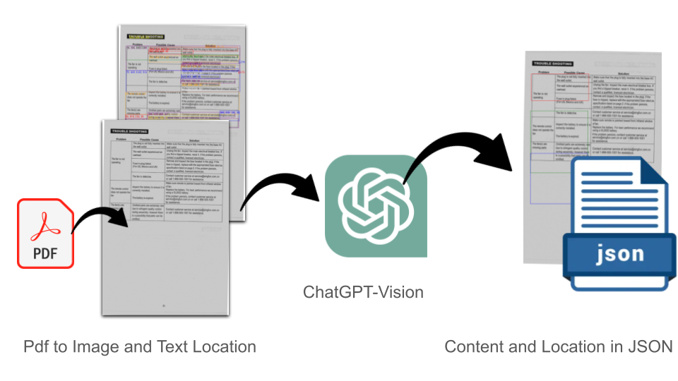

# PDF Troubleshooting Guide to JSON Converter

## Overview

This repository contains a Flask application designed to convert PDF files of troubleshooting guides into annotated images and structured JSON. It leverages Tesseract OCR for text recognition within the documents and utilizes OpenAI's GPT-4 model to structure the recognized content in a JSON format.



## Features

- **PDF Processing**: Converts PDF documents into images for OCR processing.
- **OCR Text Extraction**: Employs Tesseract OCR to detect and extract text from images.
- **Text and Bounding Box Annotation**: Enhances images with the extracted text and bounding box coordinates.
- **JSON Structuring**: Organizes OCR results into a JSON format, detailing content by problems, causes, solutions, and location.
- **Containerization**: Deployable as a Docker container for ease of setup and consistent environments.

## Requirements

- Python 3.7 or later
- Flask
- pytesseract
- pdf2image
- PIL (Pillow)
- json
- base64
- openai
- dotenv
- Docker (for deployment)

## Setup Instructions

### OpenAI API Key

1. Obtain an API key from [OpenAI](https://openai.com/).

2. Create a `.env` file in the repository root and add your OpenAI API key:

```OPENAI_API_KEY='your_api_key_here'```

## Usage

### Running the Example

Use the `test.sh` script to build, run, and interact with the app within a Docker container.

### Making API Calls

Utilize `test.sh` to send a POST request with your PDF for processing. Modify `PDF_FILE_PATH` and `PAGES` in the script to your PDF file's path and the pages you wish to process.

To start the process:

```./test.sh```

### Outputs

The Flask app will output annotated images and a JSON file with the structured text extracted from the PDF.

The example of output API is following:
```
{
  "TroubleShooting": [
    {
      "Causes": [
        "The plug is not fully inserted into the wall outlet.",
        "The wall outlet experienced an overload.",
        "Fuse in plug failed. (For US, Mexico and UK)",
        "The fan is defective."
      ],
      "Problem": "The fan is not operating",
      "ProblemBoundingBox": [
        73,
        205,
        5423,
        1288
      ],
      "ProblemPage": 8,
      "Solutions": [
        "Make sure that the plug is fully inserted into the base AC wall outlet.",
        "Unplug the fan. Inspect the main electrical breaker box. If you find a tripped breaker, reset it. If the problem persists, contact a qualified, licensed electrician.",
        "Remove and inspect the fuse located in the plug. If the fuse is tripped, replace with the appropriated fuse rated as specification listed on page 2. If the problem persists, contact a qualified, licensed electrician.",
        "Contact customer service at service@singfun.com.cn or call 1-866-505-1001 for assistance."
      ]
    },
    {
      "Causes": [
        "Inspect the battery to ensure it is correctly installed.",
        "The battery is expired."
      ],
      "Problem": "The remote control does not operate the fan",
      "ProblemBoundingBox": [
        72,
        443,
        1112,
        211
      ],
      "ProblemPage": 8,
      "Solutions": [
        "Make sure remote is pointed toward front infrared window of fan.",
        "Replace the battery. For best performance we recommend using a DL2032 battery. If the problem persists, contact customer service at service@singfun.com.cn or call 1-866-505-1001 for assistance."
      ]
    },
    {
      "Causes": [
        "Omitted parts are extremely rare due to stringent quality control during assembly; however there is a possibility that parts can be omitted."
      ],
      "Problem": "The fan(s) are missing parts",
      "ProblemBoundingBox": [
        65,
        876,
        219,
        39
      ],
      "ProblemPage": 8,
      "Solutions": [
        "Contact customer service at service@singfun.com.cn or call 1-866-505-1001 for assistance."
      ]
    }
  ]
}
```